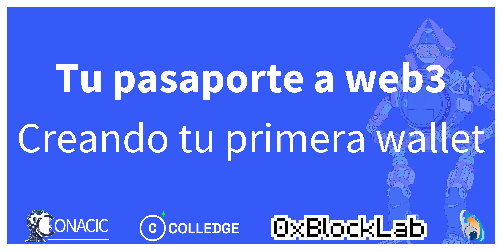

Bienvenido a este workshop de web3, en el cual aprenderás a crear tu primera wallet y a interactuar con la blockchain de capa 2 de Ethereum, **Arbitrum**.

## ¿Qué es web3?

Web3 es un conjunto de tecnologías que permiten la interacción con la blockchain de Ethereum. Estas tecnologías incluyen:

- **Wallets**: Son las encargadas de almacenar las claves privadas y públicas de las cuentas de Ethereum. También permiten firmar transacciones y mensajes, y enviarlos a la blockchain.

- **Ethereum RPC**: Es un protocolo de comunicación que permite a las aplicaciones web3 comunicarse con la blockchain de Ethereum. Este protocolo se basa en el protocolo JSON-RPC.

- **Ethereum ABI**: Es un protocolo de comunicación que permite a las aplicaciones web3 comunicarse con los contratos inteligentes de Ethereum. Este protocolo se basa en el protocolo JSON-RPC.

- **Ethereum Smart Contracts**: Son programas que se ejecutan en la blockchain de Ethereum. Estos programas se ejecutan en una máquina virtual llamada EVM (Ethereum Virtual Machine).

## ¿Qué es Arbitrum?

Arbitrum es el proyecto de capa 2 número uno del mercado. A simple vista es una blockchain regular con transacciones rápidas y baratas, pero se destaca por estar respaldada por los validadores de Ethereum. Es decir, conserva la seguridad y descentralización de Ethereum pero sin perder la escalabilidad. 

## ¿Qué es un rollup en el ecosistema crypto?

Las rollups se usan para reducir la carga en la blockchain principal de Ethereum y mejorar la eficiencia de las transacciones. Esta técnica de escalado consiste en agrupar muchas transacciones en una blockchain secundaria y después presentar un “resumen” de estas en la principal.

Imaginemos que queremos guardar muchas fotos en nuestro celular pero no tenemos memoria. Una opción podría ser descargar las fotos en una computadora y comprimirlas en un archivo ZIP o RAR. Estos archivos pesan mucho menos que todas las fotos por separado, entonces, lo podemos guardar en el celular sin problemas.

Así es exactamente como funcionan los rollups, se guardan transacciones en una capa 2, se comprimen y sólo eso se sube a la blockchain principal, también llamada capa 1.

## ¿Qué necesito para empezar el workshop?

Para este workshop necesitarás:

### Wallet

Para este workshop necesitarás una wallet. Puedes usar la que quieras, pero te recomendamos [Metamask](https://metamask.io/). Pero si quieres usar otra, puedes hacerlo sin problemas.

### Ether en la red de test de Arbitrum

Para este workshop necesitarás Ether en la red de test de Arbitrum. Puedes conseguirlo en [este faucet](https://faucet.triangleplatform.com/arbitrum/goerli).

### Navegador web

Para este workshop necesitarás un navegador web. Puedes usar el que quieras, pero te recomendamos [Brave](https://brave.com/).

### Editor de texto

Para este workshop necesitarás un editor de texto. Puedes usar el que quieras, pero te recomendamos [Visual Studio Code](https://code.visualstudio.com/).

### Node.js y npm

Para este workshop necesitarás Node.js y npm. Puedes descargarlos [aquí](https://nodejs.org/es/).

### Git

Para este workshop necesitarás Git. Puedes descargarlo [aquí](https://git-scm.com/).

## ¿Cómo empezar el workshop?

Para empezar el workshop, debes clonar este repositorio. Para ello, debes ejecutar el siguiente comando en tu terminal:

```bash
git clone https://github.com/jistro/CONACIC2023
```

Una vez clonado el repositorio, debes moverte a la carpeta `web-app` y ejecutar el siguiente comando en tu terminal:

```bash
npm install
```

Si quieres experimentar un poco con el código, puedes instalar foundry [aquí](https://book.getfoundry.sh/getting-started/installation).


**Nota**: No es necesario instalar foundry para completar 
el workshop, pero si quieres experimentar con el código, te recomendamos instalarlo en linux o mac.

Y listo, ya puedes empezar el workshop. ¡Que lo disfrutes!

